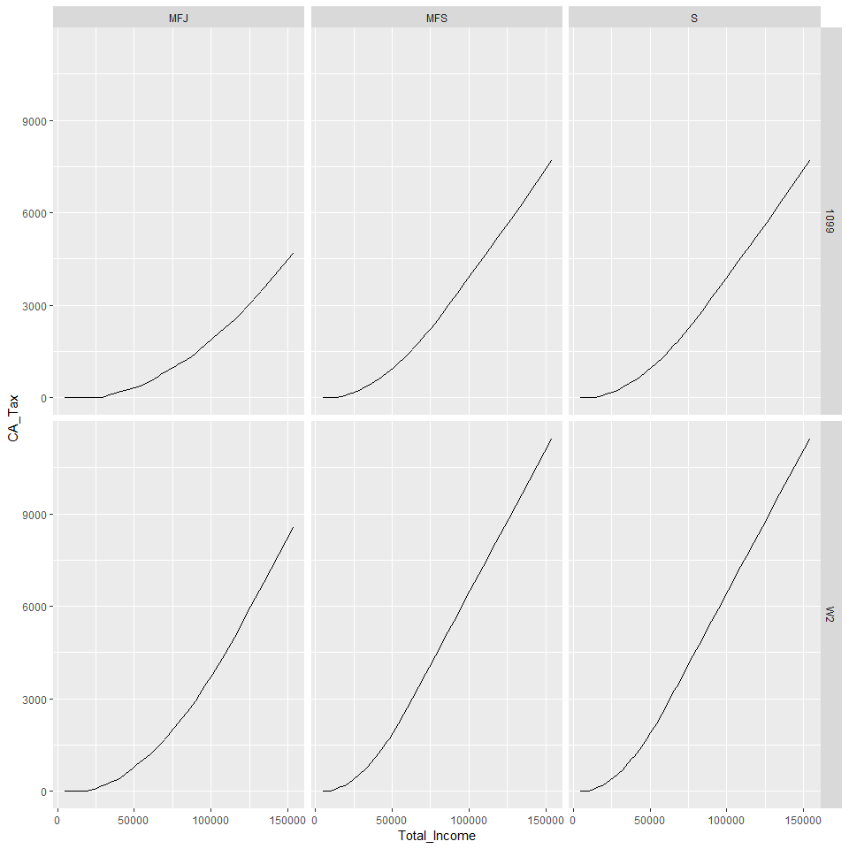
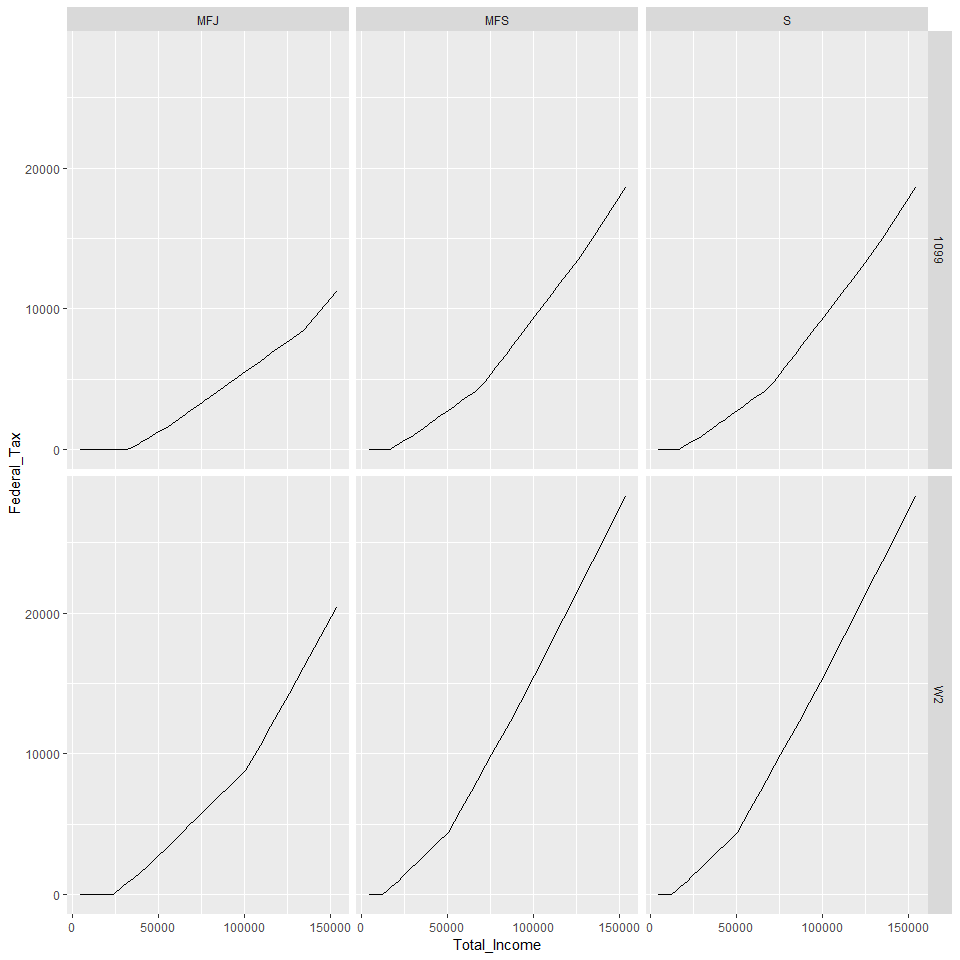
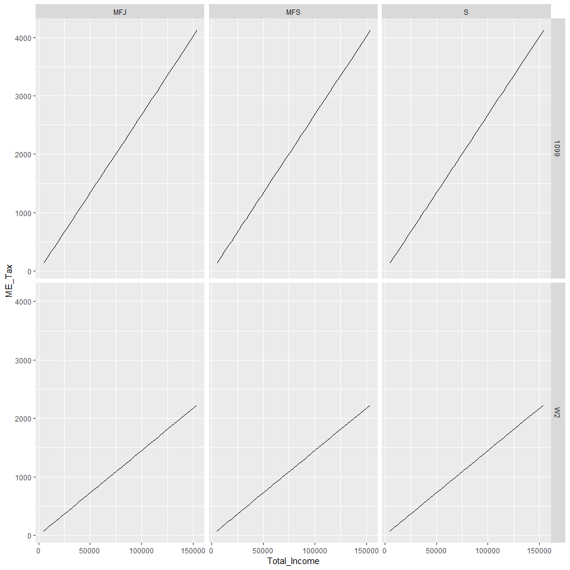
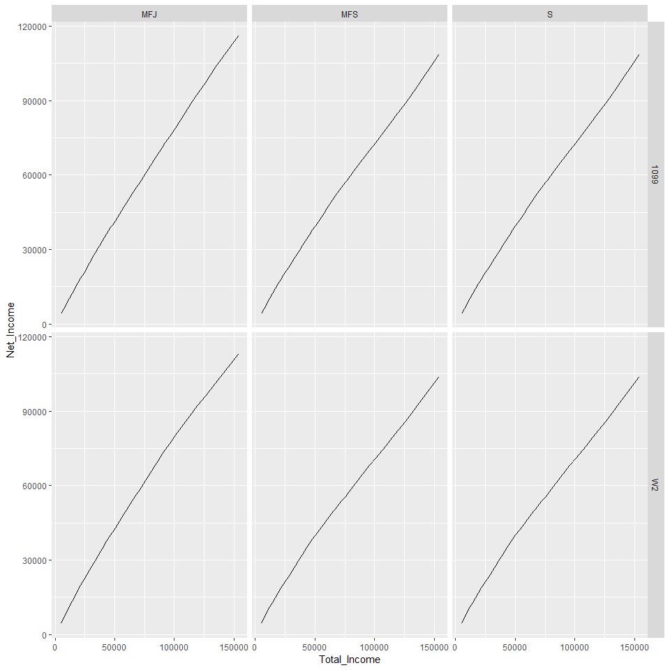
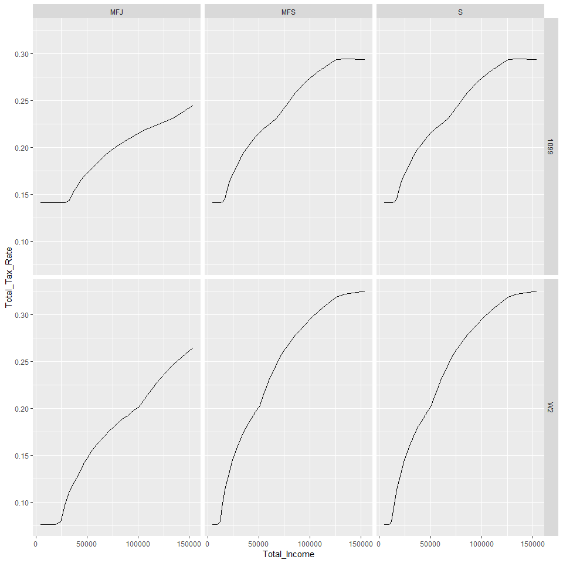

### 2018 Tax Calculations

Below are 2018 tax calculations based various sources.
Features: Social Security, Medicare, Federal, State State Taxes Varying Filing Statuses, 1099 / W2 Differentiation, Contractor Expenses, Above the Line Deductions, Standard Deductions, Itemized Deductions, and a Basic QDI Deduction (20%).


```r
setwd("Q:/Alec/Base")
load("base.RData") ;lib()
setwd("~/Taxes")
load("Tax Data.RData")
tax_data=y ; rm(y)
```

### About Income
This page examines two types of income, contractor and/or cash income (1099-Misc) and wages (W-2).
1099 income includes income from 1099-K's too, typically from self employed employees such as working for Uber or Lyft.
W-2 income includes hourly wage and or salary wage typically from an hourly position.

1099 income may also be reduced by qualified work expenses, essentially all expenses required to work and certain, non-commuting car expenses.

The main distinction of the two is who pays the second half of a taxpayer's social security and medicare (FICA) tax.
For 1099 income, the taxpayer pays both halves of their FICA contributions, approximately 14.13% of net income below income thresholds (about $120,000).
For W-2 income, taxpayers' employees pays the second half of their FICA contribution, cutting FICA contributions to approximately 7.65% below income thresholds.

Note that the FICA contribution difference is not double, 14.13%/7.65%=1.84, as half of FICA contributions from 1099 income are deductible.

Above the line deductions, such as student loan interest payments and contributions to qualified retirement accounts, reduces taxable income for both income types.

### About Filing Status
This page also examines 3 filing statuses: Single (S), Married Filing Separately (MFS), and Married Filing Jointly (MFJ).
A S filing status implies a taxpayer is not married and does not have any qualified dependents.
A MFS filing status implies a taxpayer is married but doesn't file with their husband/wife on their tax return for whatever reason but may have qualified dependents.
A MFJ filing status implies a taxpayer is married and is filing with their husband/wife and may have qualified dependents.

Each filing status has different tax brackets and is (not) eligible for certain credits and exemptions.

### About Dependency & Credits
This page does not examine dependency. With regards to tax liability, there is no (dis)advantage of being a dependent or not.
Recent changes to the tax law removed the personal and dependency exemption, eliminating the tax deduction of claiming one's self.

However, being a dependent or not is relevant when calculating tax credit eligibility in which further calculations, beyond this page, is required.

Most tax credits, however, do not apply for working individuals, with no children, making $40,000 and above.

### Important Income Formula
Total Income = (W2 Income *or* Contractor (1099) Income - Expenses) - Above the Line Deductions
Net Income   = Total Income - All Tax

### Total Income vs State Tax

```r
tax_data %>% ggplot(aes(x=Total_Income,y=CA_Tax))+geom_line()+facet_grid(Income_Type~Status)
```

<!-- -->

### Total Income vs Federal Tax

```r
tax_data %>% ggplot(aes(x=Total_Income,y=Federal_Tax))+geom_line()+facet_grid(Income_Type~Status)
```

<!-- -->

### Total Income vs Medicare Tax

```r
tax_data %>% ggplot(aes(x=Total_Income,y=ME_Tax))+geom_line()+facet_grid(Income_Type~Status)
```

<!-- -->

### Total Income vs Social Security Tax

```r
tax_data %>% ggplot(aes(x=Total_Income,y=SS_Tax))+geom_line()+facet_grid(Income_Type~Status)
```

<!-- -->

### Total Income vs Net Income

```r
tax_data %>% ggplot(aes(x=Total_Income,y=Net_Income))+geom_line()+facet_grid(Income_Type~Status)
```

<!-- -->

### Total Income vs Total Tax Rate

```r
tax_data %>% ggplot(aes(x=Total_Income,y=Total_Tax_Rate))+geom_line()+facet_grid(Income_Type~Status)
```

<!-- -->


Details per tax situation can be viewed under the Tax Data csv file.
https://github.com/lepealec/Taxes/blob/master/Tax%20Data.csv

Filing Status = MFJ, MSF, S, (Married Filing Jointly, Married Filing Seperately, Single)

Hourly Rate = Hourly Rate ($/hr)

Hours = Hours (per month)

Income Type = W-2, 1099, (Wage/Salary or Contract)

Sources included in tables and tax Tables have detailed individual brackets.
