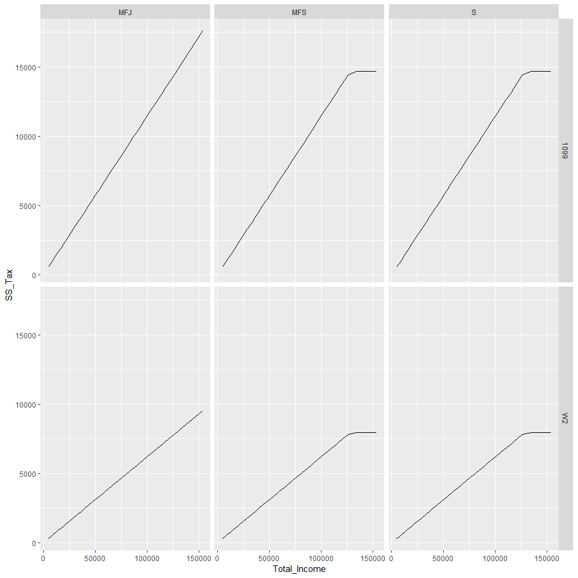

### 2018 Tax Calculations

Below are 2018 tax calculations based various sources.
Features: Social Security, Medicare, Federal, State State Taxes Varying Filing Statuses, 1099 / W2 Differentiaion, Contractor Expenses, Above the Line Deductions, Standard Deductions, Itemized Deductions, and a Basic QDI Deduction (20%).


```r
setwd("Q:/Alec/Base")
load("base.RData") ;lib()
setwd("~/Taxes")
load("Tax Data.RData")
```

### Total Income vs State Tax

```r
y %>% ggplot(aes(x=Total_Income,y=CA_Tax))+geom_line()+facet_grid(Income_Type~Status)
```

<!-- -->

### Total Income vs Federal Tax

```r
y %>% ggplot(aes(x=Total_Income,y=Federal_Tax))+geom_line()+facet_grid(Income_Type~Status)
```

<!-- -->

### Total Income vs Medicare Tax

```r
y %>% ggplot(aes(x=Total_Income,y=ME_Tax))+geom_line()+facet_grid(Income_Type~Status)
```

<!-- -->

### Total Income vs Medicare Tax

```r
y %>% ggplot(aes(x=Total_Income,y=SS_Tax))+geom_line()+facet_grid(Income_Type~Status)
```

<!-- -->

### Total Income vs Net_Income

```r
y %>% ggplot(aes(x=Total_Income,y=Net_Income))+geom_line()+facet_grid(Income_Type~Status)
```

<!-- -->

### Total Income vs Total Tax Rate

```r
y %>% ggplot(aes(x=Total_Income,y=Total_Tax_Rate))+geom_line()+facet_grid(Income_Type~Status)
```

<!-- -->


Details per tax situation can be downloaded and viewed under the Output Tables folder.
Tables inclcude:


Filing Status = MFJ, MSF, S, (Married Filing Jointly, Married Filing Seperately, Single)

Hourly Rate = Hourly Rate ($/hr)

Hours = Hours (per month)

Income Type = W-2, 1099, (Wage/Salary or Contract)

Sources included in tables and tax Tables have detailed individual brackets.
